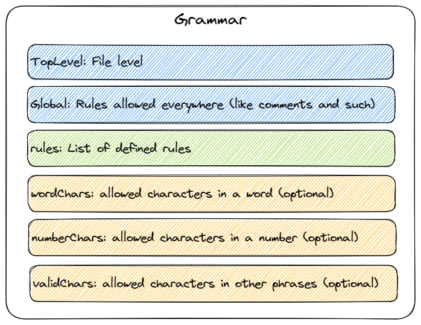

# ima parse

Another parser, but wait! ...it might be **easy** to use. The idea is that there are certain limits, that limit the complexity.
Perfect for parsing your own DSL or even an existing language, which requires only one Grammar JSON file to generate an AST.

# What makes this parser so _easy_?

1. You get an AST which can be directly used to interpret the parsed text
1. No runtime npm dependencies
1. This is an opinionated parser, with some limit (see below).
1. These limits mean:
    1. Fastest possible procedural parser (in JavaScript)
    1. Simple source code
    1. Focussed on supporting the common subset instead of everything that might be possible.
    
# Downsides
1. Your language has to be non-ambigious where scopes are shared. There is no backtracking, lookahead or multipath matching.
1. The runtime is always javascript and the generated types only in TypeScript.
1. The grammar is, by design, very verbose. No (E)BNF support.
1. Whitespace characters are always ignored (unless in text mode for comments etc). That excludes some languages as well.
1. Nobody is really using it but me. I think there is no real good reason to use this, but if you do I will support you.

# How to use?

1. Parse the input by giving the Parser the Grammar and the input.
2. Build the types of the AST and build the builders of that same AST.
3. Give the output of step 1 and step 2 to the `buildContentTree` method and receive an object that adheres to the typings created in step 2.

## Grammar

A language always starts with a grammar. This grammar contains all the concepts (rules) and how they can be used in a text.

By default, a certain character set is used to distinguish words from numbers and allowed characters from non-recognised ones. Most probably only wordChards will be overridden to allow maybe `$` and `-`.

## Grammar Rule definition parts

A rule is a concept in the grammar. This concept consist of certain parts, of which some might be optional:

* **Keyword**: required phrase. Not relevant for the compiler
* **Modifiers**: list of phrases that can occur. Might be required and singular
* **Identifier**: Noun or variable word
* **Number**: Integers
* **Text**: Any char is allowed here. Useful for string literals/comments etc.
* **Paths**: Set of Simple parts (all above). Sort of like a mini-rule that tries multiple paths at once until one or none survives
* **Rules**: Reference to one or more rules. Might be required, singular and have a separator (like a comma)

## Examples
There is an XML example in the examples folder and some example code snippets in the unit tests.

# Roadmap
* [ ] Add LSP support
* [x] Allow choosing your own noun-characters (custom word chars, like a - and a $)
* [x] Allow choosing start chars and other chars for custom char options
