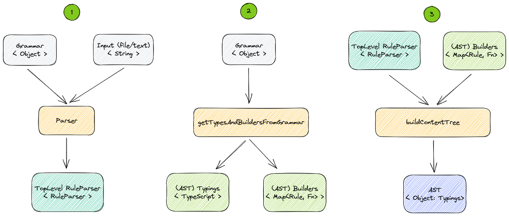
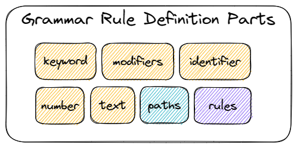

# ima parse

Another parser, but wait! it might be easy to use. The idea is that there are certain limits, that limit the complexity.
Perfect for parsing your own DSL or even an existing language, which requires only one Grammar JSON file to generate an AST.

# How to use?

1. Parse the input by giving the Parser the Grammar and the input.
2. Build the types of the AST and build the builders of that same AST.
3. Give the output of step 1 and step 2 to the `buildContentTree` method and receive an object that adheres to the typings created in step 2.

## Grammar

A language always starts with a grammar. This grammar contains all the concepts (rules) and how they can be used in a text.

By default, a certain character set is used to distinguish words from numbers and allowed characters from non-recognised ones. Most probably only wordChards will be overridden to allow maybe `$` and `-`.

## Grammar Rule definition parts

A rule is a concept in the grammar. This concept consist of certain parts, of which some might be optional:

* **Keyword**: required phrase. Not relevant for the compiler
* **Modifiers**: list of phrases that can occur. Might be required and singular
* **Identifier**: Noun or variable word
* **Number**: Integers
* **Text**: Any char is allowed here. Useful for string literals/comments etc.
* **Paths**: Set of Simple parts (all above). Sort of like a mini-rule that tries multiple paths at once until one or none survives
* **Rules**: Reference to one or more rules. Might be required, singular and have a separator (like a comma)

## Examples
... todo

# Roadmap
* [ ] Add LSP support
* [x] Allow choosing your own noun-characters (custom word chars, like a - and a $)
* [ ] Allow choosing start chars and other chars for custom char options
